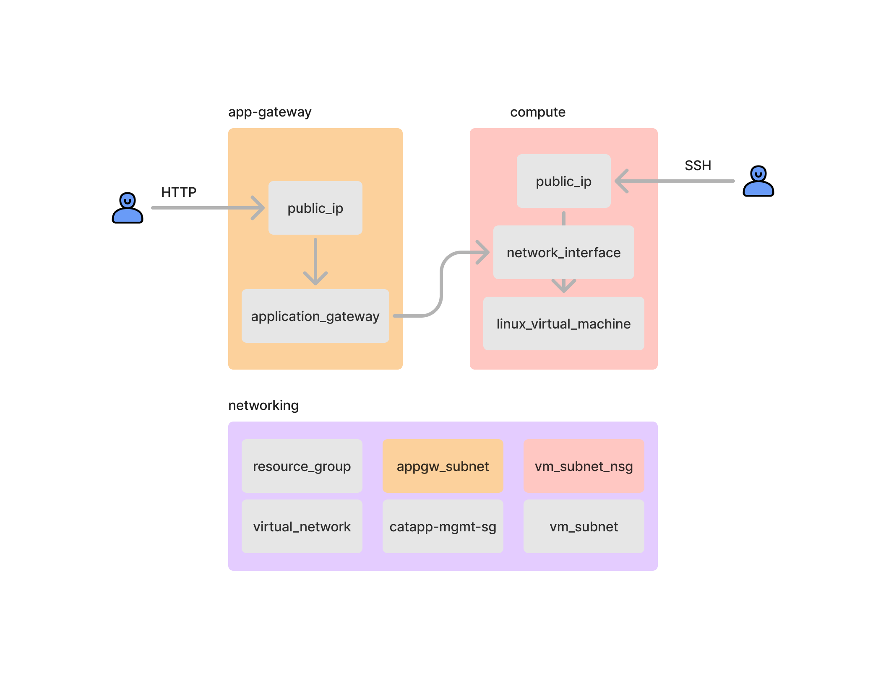

# Hashicat in Azure

This repo contains a demo app (Hashicat) built from three Terraform modules: `networking`, `compute` and `app-gateway`.

- [Networking](./networking/): creates the necessary resources for connecting the different components: a VNET, two subnets (one for the VMs and one for the Application Gateway). Additionally, this module also creates the resource group used by all the other resources.

    Two security groups are also created: one to establish the connection between the two subnets and another to allow SSH traffic to the VM (for configuration and management).

- [Compute](./compute/): creates a VM with a network interface and the provisioner to install and start the `Hashicat` web app.

- [Application Gateway](./app-gateway/): an app gateway that allows HTTP traffic from users into the web app and a public IP.

The components are created like in the diagram below:


## Create a service principal

In order to create these configurations you'll need a Service Principal in your Azure subscription. You can create it using the Azure CLI (you can install it with `brew update && brew install azure-cli` on your Mac):

```bash
az ad sp create-for-rbac --role="Contributor" --scopes="/subscriptions/<SUBSCRIPTION_ID>"
```

After running this command you'll get a response like the one below:

```json
{
  "appId": "9ce786...",
  "displayName": "azure-cli...",
  "password": "ZCP8...",
  "tenant": "237fb..."
}
``` 
In order to use these Terraform configurations you'll have to export the following environment variables in your current session:

```bash
export ARM_CLIENT_ID=<appID-from-previous-response>
export ARM_CLIENT_SECRET=<password-from-previous-response>
export ARM_SUBSCRIPTION_ID=<your-subscription-id>     
export ARM_TENANT_ID=<your-tenant-id>  
```

## Deploy:
Once these variables have been created you can deploy the configuration:

```bash
terraform init
terraform apply -auto-approve
```

## Cleanup:

```bash
terraform destroy -auto-approve
```

---
Original version of Hashicat in Azure [here](https://github.com/hashicorp/hashicat-azure)
